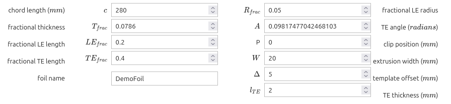

# CQFoil
## A utility for creating 3D-printable templates for shaping rudders, daggerboards and other sailboat foils

To run this utility in the cloud on Binder, click this button,

then select `Run All Cells` under the `Run` menu.

After some initialization output, the notebook will present textboxes in which foil parameters can be entered.
Clicking a button then generates a 3D-printable template file, ready for download.

## Purpose
The purpose of this utility is to enable the user to recreate or closely approximate the foil dimensions specified by a designer of home-built boats, and to generate corresponding templates in the form of 3D-printable files. 
The utility performs the following steps:
1. Generates:
   - a half-foil shape in the $XY$ plane, representing the top half of a symmetrical foil, according to user-specified parameters.
   - a template shape, in which half-foil is represented as cut-out from the bottom of a rectangular block.
2. Plots the half-foil and template shapes, and saves them in a 2D CAD format called DXF.
   
3. Generates a 3D solid by extruding the template shape in the $Z$ direction, and saves it in a 3D format called STL.
   

STL files can be directly printed on most 3D printers.
The utility is implemented in [Python](https://www.python.org/) code, and presented in a format called a [Jupyter notebook](https://jupyter.org/). 
The utility runs in the cloud on [Binder](https://mybinder.org/), which is a free online server for Jupyter notebooks.
> Note: Binder must build the environment for each Jupyter notebook that it runs; it then keeps that environment in the stack until it is displaced by other environments. This means that the first time this utility is launched in Binder, there will be a delay while the environment is built. Launching will be faster afterwards, as long as the environment is reused frequently enough to prevent its being displaced.

The utility can also be downloaded (using git) and the environment built locally (using miniconda or equivalent), to run on a user's computer. 

## Background
This utility is based on a study of lift and drag on flat-sided foils by [Saporito *et al*. (2020)](https://research.chalmers.se/publication/519549/file/519549_Fulltext.pdf).
These authors used computational fluid dynamics to calculate the foil shapes with the optimal lift and drag coefficients, from among a family of foil shapes in which the leading and trailing edge shapes are defined by [NURBS](https://en.wikipedia.org/wiki/Non-uniform_rational_B-spline)'s.
These foil shapes were inspired by an earlier study by [Neil Pollock](https://archive.org/details/DTIC_ADA189047) which is cited by Australian boat designer [Michael Storer](https://www.storerboatplans.com/boat-design/performance/naca-and-highly-accurate-centreboard-and-rudder-sections-is-it-possible/) as being efficient and suited for construction by amatuer home-builders.

The utility uses [nurbspy](https://github.com/turbo-sim/nurbspy) to calculate the NURBS curves, [ezdxf](https://github.com/mozman/ezdxf) to write 2D dxf files,
and [CadQuery](https://github.com/CadQuery/cadquery) to generate 3D stl files from the 2D dxf files.

## Parameters
Parameters for foil size and shape are as specified by [Saporito *et al*. (2020)](https://research.chalmers.se/publication/519549/file/519549_Fulltext.pdf):

- Chord length ($c$) is specified in milimeters
- Foil thickness ($T_{frac}$), leading edge length ($LE_{frac}$) and trailing edge length ($TE_{frac}$) are specified as fractions of chord length (*e.g.* a chord length of $c=100mm$ and a fractional foil thickness $T_{frac}=0.1$ means the foil is $10mm$ thick)
- The radius of the leading edge ($R_{frac}$) is specified as a fraction of the foil thickness
- The closing angle of the trailing edge ($A$) is in radians (to convert degrees to radians, divide by $180$ and multiply by $\pi$, which is $3.14159$)

Several other parameters are used to generate a template from the foil:
- The template offset ($\Delta$) is the thickness of the template above, in front of and behind the foil
- The extrusion width ($W$) is the width of the template (that is, the length in the $Z$-direction if the foil outline lies in the $XY$ plane)
- The clip position ($P$) is used if separate templates are wanted for the leading and trailing edges
    - If $P=0$, the template covers the whole foil
    - If $P>0$, the template covers only the leading P millimeters of the foil (*e.g.* $P=100$ results in a template for the forward $100mm$ of the foil)
    - If $P<0$, the template covers only the trailing -P millimeters of the foil (*e.g.* $P=-100$ results in a template for the aft $100mm$ of the foil)
- The trailing edge thickness ($l_{TE}$) is used if a squared-off trailing edge is wanted (*e.g.*, $l_{TE}=0$ results in a sharp trailing edge, $l_{TE}=2$ results in a trailing edge with $2mm$ thickness, *etc*.)

