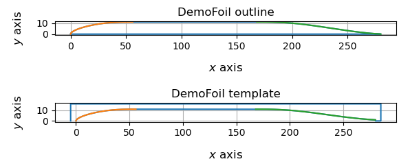
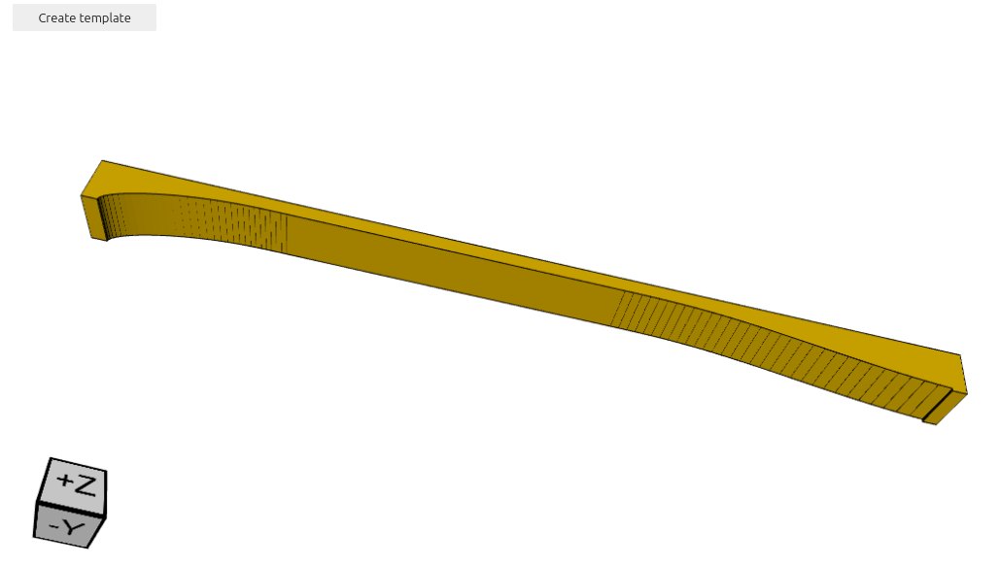

# CQFoil
## A utility for creating 3D-printable templates for shaping rudders, daggerboards and other sailboat foils

This utility generates flat-sided 2-dimensional foil sections for applications in sailboats, and 3D-printable templates for accurately shaping the corresponding foils. 

### Quickstart
There are two versions of this utility:

1. A version based on a study by [Saporito *et al*. (2020)](https://research.chalmers.se/publication/519549/file/519549_Fulltext.pdf).
   To run this utility in the cloud on Binder, click this button,

    

   then select `Run All Cells` under the `Run` menu.
   
   The Jupyter notebook implementing this version is in this repository at [this link](./cqfoil.ipynb).

2. A version based on a study by [Pollock (1987)](https://archive.org/details/DTIC_ADA189047) which is cited by Australian boat designer [Michael Storer](https://www.storerboatplans.com/boat-design/performance/naca-and-highly-accurate-centreboard-and-rudder-sections-is-it-possible/) as being efficient and suited for construction by amatuer home-builders.

   To run this utility in the cloud on Binder, click this button,
   
    

   then select `Run All Cells` under the `Run` menu.
   
   The Jupyter notebook implementing this version is in this repository at [this link](./cqfoilP.ipynb).

After some initialization output, the notebook will present textboxes in which foil parameters can be entered.
Clicking a button then generates a 3D-printable template file, ready for download.
> ***Note: Binder must build the environment for each Jupyter notebook that it runs; it then keeps that environment in the stack until it is displaced by other environments. This means that the first time this utility is launched in Binder, there will be a delay while the environment is built. Launching will be faster afterwards, as long as the environment is reused frequently enough to prevent its being displaced.***

## Purpose
The purpose of this utility is to enable the user to recreate or closely approximate the foil dimensions specified by a designer of home-built boats, and to generate corresponding templates in the form of 3D-printable files. 
The utility performs the following steps:

1. Generates:
   - a half-foil shape in the $XY$ plane, representing the top half of a symmetrical foil, according to user-specified parameters.
   - a template shape, in which half-foil is represented as cut-out from the bottom of a rectangular block.
2. Plots the half-foil and template shapes, and saves them in a 2D CAD format called DXF.
   
3. Generates a 3D solid by extruding the template shape in the $Z$ direction, and saves it in a 3D format called STL that can be directly printed on most 3D printers.
   

## Background
This utility is based on studies of lift and drag on flat-sided foils by [Pollock (1987)](https://archive.org/details/DTIC_ADA189047) and [Saporito *et al*. (2020)](https://research.chalmers.se/publication/519549/file/519549_Fulltext.pdf).
These authors used computational fluid dynamics to calculate the foil shapes with the optimal lift and drag coefficients, from among families of foil shapes in which the leading and trailing edge shapes are defined by polynomials or [NURBS](https://en.wikipedia.org/wiki/Non-uniform_rational_B-spline)'s.

- The foil shapes suggested by [Pollock (1987)](https://archive.org/details/DTIC_ADA189047) are used in designs by [Michael Storer](https://www.storerboatplans.com/boat-design/performance/naca-and-highly-accurate-centreboard-and-rudder-sections-is-it-possible/), and found to be successful in numerous home-built boats.

- The foil shapes suggested by [Saporito *et al*. (2020)](https://research.chalmers.se/publication/519549/file/519549_Fulltext.pdf) come from a later study with more refined calculations, but are untried as far as I know for use in home-built sailboats.

The utility is implemented in [Python](https://www.python.org/) code, and presented in a format called a [Jupyter notebook](https://jupyter.org/). 
The utility runs in the cloud on [Binder](https://mybinder.org/), which is a free online server for Jupyter notebooks.
> ***Note***: Binder must build the environment for each Jupyter notebook that it runs; it then keeps that environment in the stack until it is displaced by other environments. This means that the first time this utility is launched in Binder, there will be a delay while the environment is built. Launching will be faster afterwards, as long as the environment is reused frequently enough to prevent its being displaced.

The utility can also be downloaded from this repository (using `git`) and the environment built locally (using `miniconda`, `mamba` or equivalent), to run on a user's computer. 

